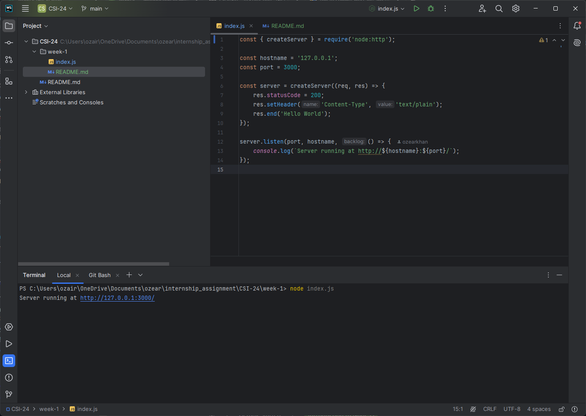
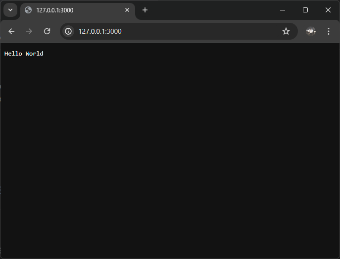

### Week 1 Assignment: Set up Node.js and create your first application

**Assignment Tasks:**
- Install Node.js and build a simple "Hello World" application.
- Understand the basics of the Node.js runtime and execute your application.

**Resources:**
- [Getting Started with Node.js](https://nodejs.org/en/learn/getting-started/introduction-to-nodejs)

**Screenshot of the code**

- 

**Output**

- 